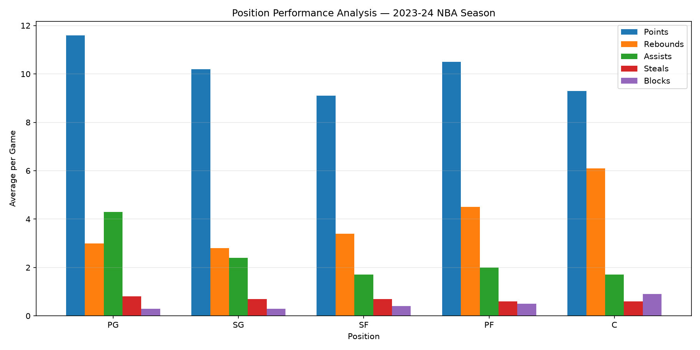
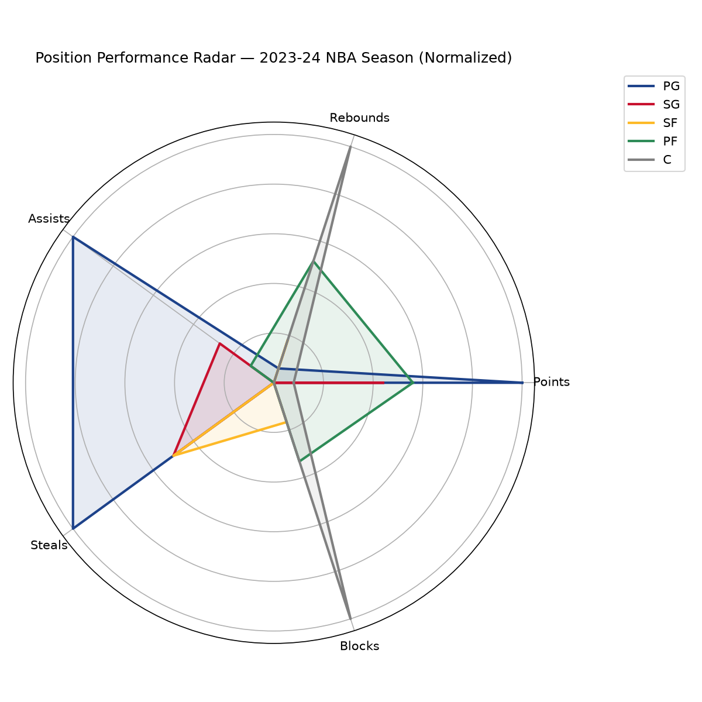
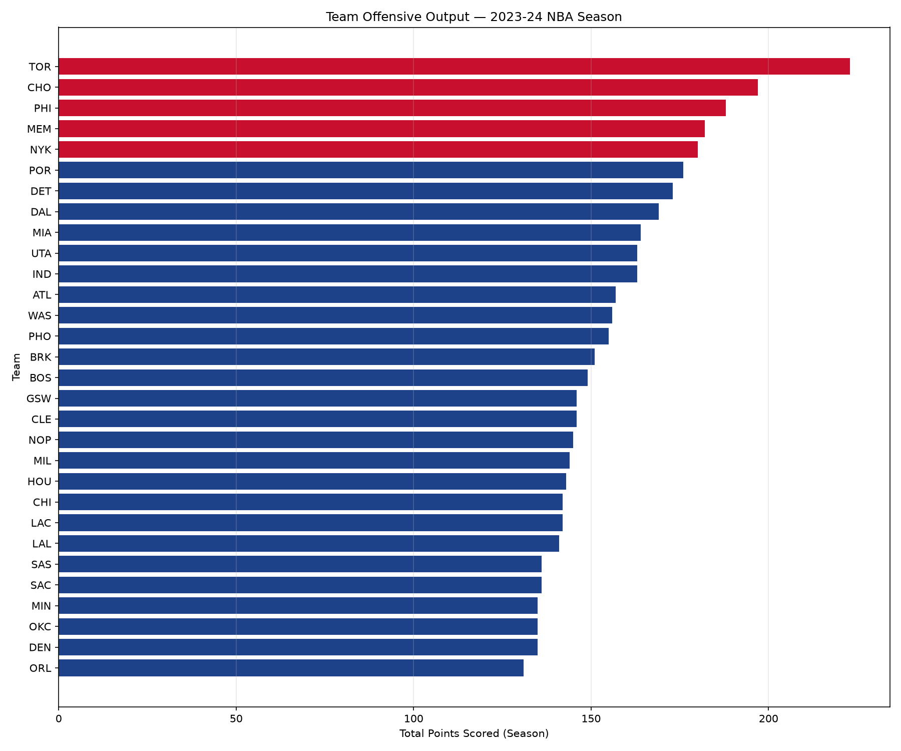
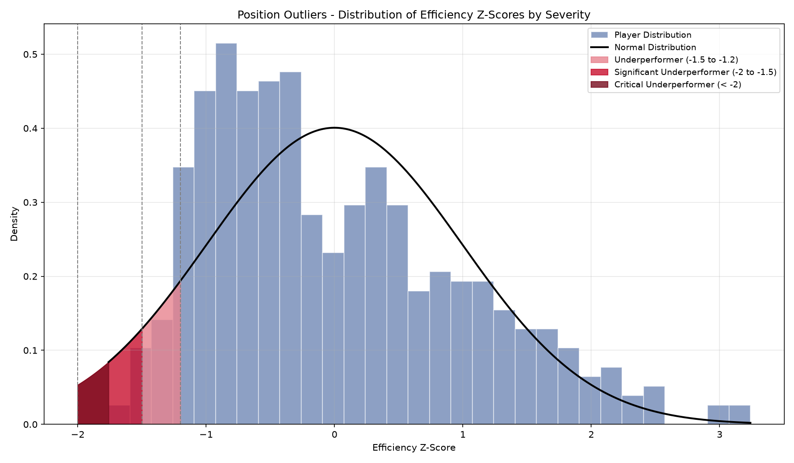
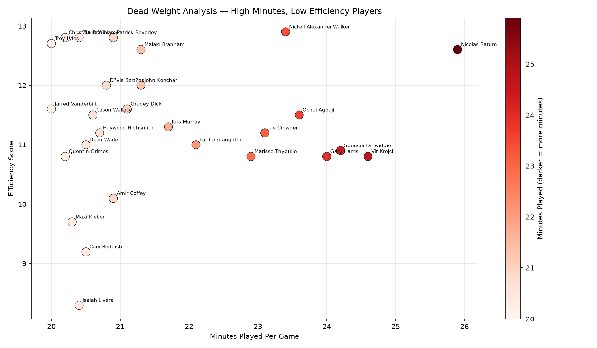

<div align="center">

<!-- Animated Banner -->


<br/>

<!-- Badges -->


<br/>


<br/>

> ### 🏀 A roster efficiency analysis tool for NBA coaching staff and front offices — identifying positional mismatches, contract value, and offensive output across the 2023–24 season.

</div>

---

## 📌 Overview

This project goes beyond typical stats leaderboards. It is designed as a **business intelligence tool for NBA organizations** — helping coaches and front offices make smarter decisions about roster construction, player deployment, and contract value.

Built on the full 2023–2024 NBA Regular Season dataset across 450+ players and 30 statistical columns, the pipeline covers data cleaning, custom metric engineering, SQL-based querying, and an interactive Power BI dashboard.

---

## 🎯 Business Questions

| # | Question | Business Value |
|---|----------|---------------|
| 1 | **Position Dominance** — Which position leads each stat category? | Benchmark players against position peers & set role expectations |
| 2 | **Team Offensive Output** — Which franchises produce the most scoring? | Compare roster output against the league to identify offensive gaps |
| 3 | **Position Outliers** — Which players don't fit their position statistically? | Identify versatile players and tactical mismatches for coaching advantage |
| 4 | **Dead Weight** — Which high-minute players hurt more than they help? | Flag bad contracts and inefficient roster spots for front office decisions |

---


## 📈 Position Outliers — Methodology

Q3 uses **z-scores** to identify players who underperform relative to their position peers:

```
z = (player_efficiency − position_average) / position_standard_deviation
```

Players are flagged into three severity tiers:
- **Underperformer** — z-score between -1.5 and -1.2
- **Significant Underperformer** — z-score between -2 and -1.5
- **Critical Underperformer** — z-score below -2

> **Limitation:** Z-scores assume a normal distribution. Real NBA performance data is right-skewed (most players cluster around average, with a long tail of elite scorers), so the theoretical bell curve doesn't perfectly match the actual data shape — visible in the distribution chart below. The z-score thresholds remain statistically valid for identifying relative outliers, but this skew is worth noting as an analytical limitation.

---

## 🖼️ Visualizations

**Position Performance Analysis**


**Position Performance Radar**


**Team Offensive Output**


**Position Outliers — Z-Score Distribution**


**Dead Weight Analysis**


---

## 🖼️ Dashboard
**League Overview**


**Team Intelligence**


**Roster Alerts**


## 🗂️ Project Structure

```
nba-season-analytics/
│
├── 📁 data/
│   ├── 2023-2024 NBA Player Stats - Regular.csv   ← raw dataset
│   └── nba_cleaned.csv                            ← cleaned output
│
├── 📁 notebooks/
│   ├── 01_cleaning.ipynb                          ← cleaning & EDA
│   └── 02_visualization.ipynb                     ← SQL connection & matplotlib
│
├── 📁 sql/
│   ├── q1_position_performance.sql
│   ├── q2_team_offensive_output.sql
│   ├── q3_position_outliers.sql
│   └── q4_dead_weight.sql
│
├── 📁 Visualisation/
│   ├── q1_position_dominance.png
│   ├── q1_radar_chart.png
│   ├── q2_team_offensive_output.png
│   ├── q3_position_outliers.png
│   ├── q4_dead_weight.png
│   └── LEAGUE OVERVIEW.png
│   ├── TEAM INTELLIGENCE.png
│   └── ROSTER ALERTS.png
│
├── 📁 dashboard/
│   └── nba_dashboard.pbix                         ← Power BI file
│
└── 📄 README.md
```

---

## ⚙️ Tech Stack

| Tool | Purpose |
|------|---------|
| **Python (pandas, matplotlib, scipy)** | Data cleaning, SQL connection, visualization |
| **SQL Server** | Aggregations, rankings, KPI queries |
| **pyodbc** | Python ↔ SQL Server connection |
| **Power BI** | Interactive dashboards |
| **Jupyter Notebook** | Analysis environment |
| **VS Code** | Development environment |

---

## 🚀 Getting Started

### 1. Clone the repo
```bash
git clone https://github.com/MohamedAkram-M/nba-season-analytics.git
cd nba-season-analytics
```

### 2. Set up the environment
```powershell
.\scripts\setup.ps1
```

### 3. Launch the notebook
```bash
jupyter notebook notebooks/01_cleaning.ipynb
```

### 4. Dataset
Download from Kaggle: [2023-2024 NBA Player Stats](https://www.kaggle.com/datasets/vivovinco/2023-2024-nba-player-stats) and place the CSV in the `/data` folder.

---

## 📈 Dashboard Preview

> Power BI dashboard coming soon — will feature:
> - Position dominance breakdown across all key stats
> - Team offensive output league-wide comparison
> - Position outlier distribution by severity tier
> - Dead weight flagging by minutes vs efficiency

---

## 👤 Author

**Mohamed Akram**
[](https://linkedin.com/in/mohamed-akram-71a3b831b/)
[](https://github.com/MohamedAkram-M)
[](mailto:ma6858349@gmail.com)

---

<div align="center">


</div>
